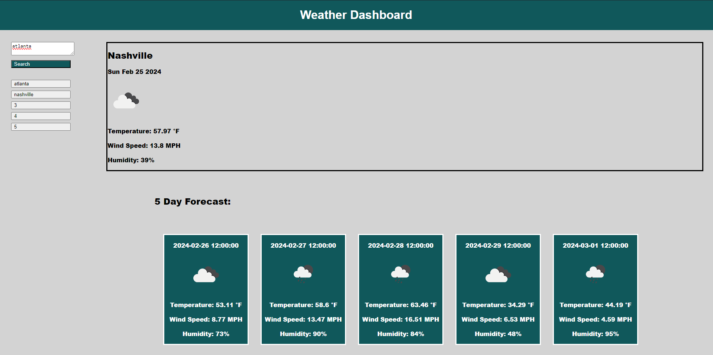

# Server-Side APIs: Weather Dashboard

Full Stack Web Development Project 6

## Live Web App
https://bcgosselin.github.io/Server-Side-APIs-Weather-Dashboard/

## Description

This project is Robert Gosselin's sixth web application challenge. This project was created to showcase his skills and aptitude using only text based instructions. This webpage's index, script, and style sheet was hand written utilizing credited resources [Credits](#credits). The goal of this challenge was to develop and engineer a fuctioning Weather Dashboard on a live website. Everything included was apart of an ongoing bootcamp to develop and hone Full Stack Web Development skills.

## Table of Contents (Optional)

- [Installation](#installation)
- [Usage](#usage)
- [Credits](#credits)
- [License](#license)

## Installation

NA

## Usage

Feel free to view below screenshot (ctrl + click).

## Credits
utilized for localStorage
    https://developer.mozilla.org/en-US/docs/Web/API/Window/localStorage

utilized for fetch data/results
    tutor via slack

utilized for pop
    https://developer.mozilla.org/en-US/docs/Web/JavaScript/Reference/Global_Objects/Array/pop

utilized for unshift
    https://developer.mozilla.org/en-US/docs/Web/JavaScript/Reference/Global_Objects/Array/unshift

## License

MIT License

Copyright (c) [2023] [Robert Gosselin]

Permission is hereby granted, free of charge, to any person obtaining a copy
of this software and associated documentation files (the "Software"), to deal
in the Software without restriction, including without limitation the rights
to use, copy, modify, merge, publish, distribute, sublicense, and/or sell
copies of the Software, and to permit persons to whom the Software is
furnished to do so, subject to the following conditions:

The above copyright notice and this permission notice shall be included in all
copies or substantial portions of the Software.

THE SOFTWARE IS PROVIDED "AS IS", WITHOUT WARRANTY OF ANY KIND, EXPRESS OR
IMPLIED, INCLUDING BUT NOT LIMITED TO THE WARRANTIES OF MERCHANTABILITY,
FITNESS FOR A PARTICULAR PURPOSE AND NONINFRINGEMENT. IN NO EVENT SHALL THE
AUTHORS OR COPYRIGHT HOLDERS BE LIABLE FOR ANY CLAIM, DAMAGES OR OTHER
LIABILITY, WHETHER IN AN ACTION OF CONTRACT, TORT OR OTHERWISE, ARISING FROM,
OUT OF OR IN CONNECTION WITH THE SOFTWARE OR THE USE OR OTHER DEALINGS IN THE
SOFTWARE.
